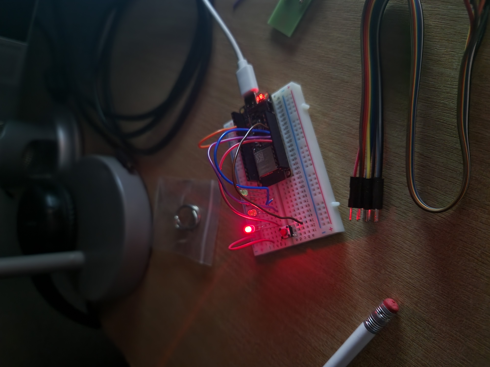
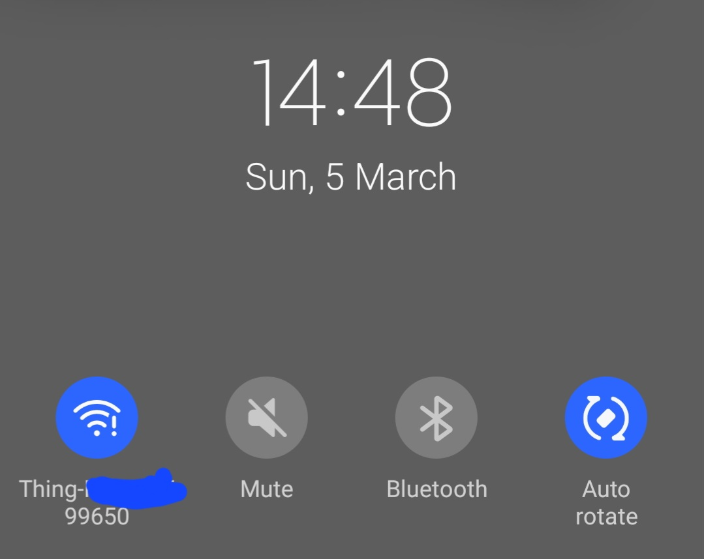
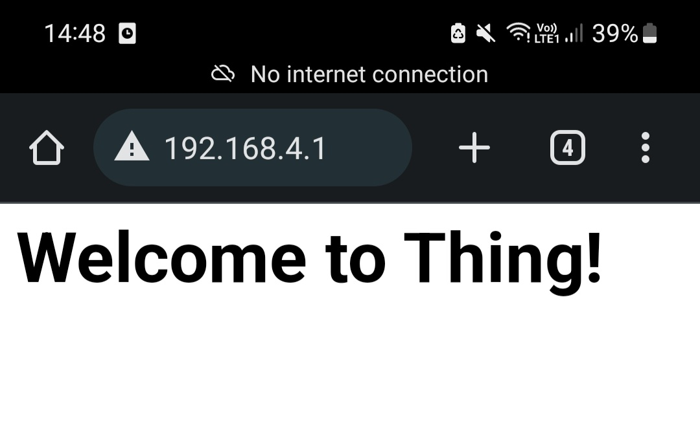

# My adventures with C++ and The Internet of Things

A series of exercises and corresponding files for the COM3505 module at The UoSheffield - a journey outside my comfort zone!

## Ongoing progress

### Traffic light task

### Wifi access point & web server task

