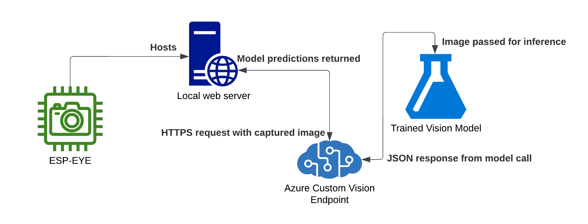
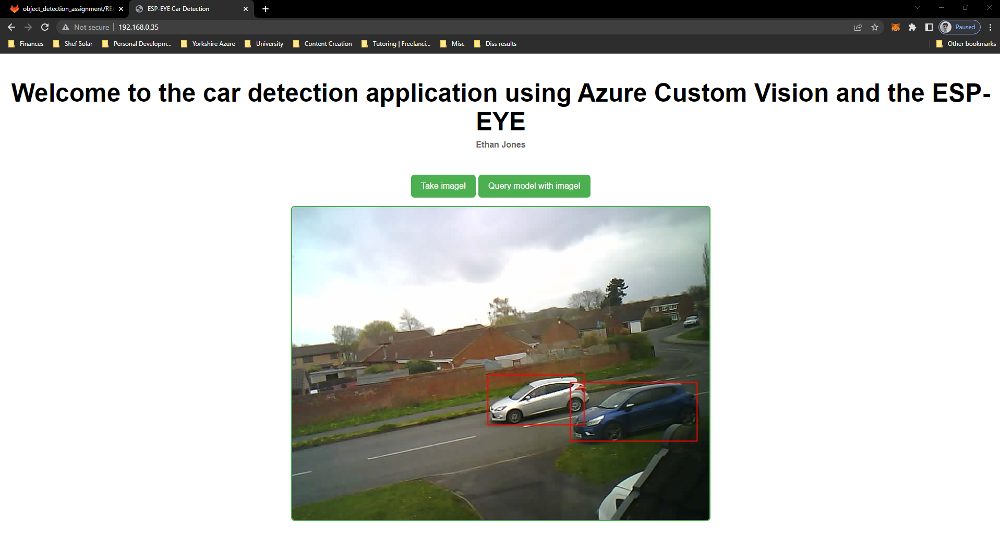
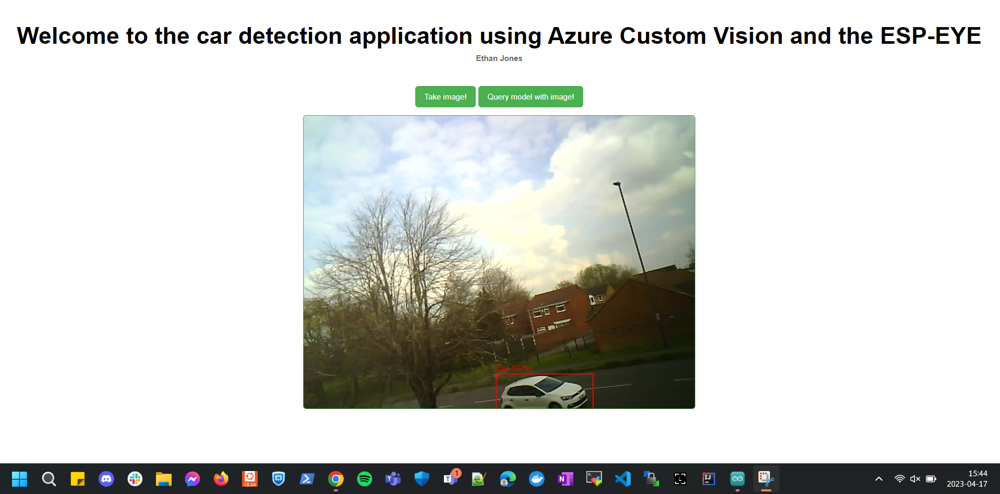

# Car Detection with Azure Custom Vision & ESP-EYE microcontroller

This directory contains all the files for my COM3505 assignment 2, with this file serving as the main form of documentation for the project.

_Code was developed and tested using C++ version 12.2.0 and was developed using the Arduino IDE 2.0.4._

_**Note: It is advised to use Arduino version 1.18.9, due to the occasional incompatability issues with 3rd-party plug-ins as will be mentioned later.**_

**Disclaimer: All training images contain no personal details i.e. faces, reg plates etc. Any images that did contain any personal information were swiftly deleted and disgarded from the model training.**

## Contents

This documentation file will contain the following:

- Problem overview and motivation,
- Technology stack and solution architecture,
- Repository files overview,
- Development process inc. issues encountered,
- Deep dive into the programmatic solution,
- Conclusion and references

## Problem overview and motivation

Now, I'm fortunate enough to be living in the picturesque Crookes for the duration of this academic year and I adore it - it's idyllic! However, nothing is ever perfect in reality ay - enter the parking issues on my road.

Living on a side street where cars park on both sides of the road can be problematic - especially for somebody who is terrible at parallel parking like me, but I digress. Aside from my own inability to park straight in the minimal spaces on my road, my partner struggles to find a space near my house when she visits.

The aim of this project is to monitor the number of cars outside my house and use some simple maths to figure out if there is an available space for somebody to park - slightly over the top, but it's all for fun ay!

## Technology stack and solution architecture

This section will break down my technology stack, both from a hardware and software perspective before looking into an architecture diagram for the solution itself.

### Technology stack

#### Hardware used

As eluded to in the title of the project, my work is based upon the ESP-EYE microcontroller. The ESP-EYE is a small, low-power camera module based on the ESP32 chip. It is designed for use in applications such as surveillance cameras and computer vision - the latter of which is what I elected to use the device for. 

The device features built-in support for SPIFFS (SPI Flash File System). SPIFFS enables the ESP-EYE to store images and other data directly on its flash memory, making it a convenient and low-cost solution for applications that require local data storage.

#### Software used

Software-wise, most of the project is C++ based because it is an efficient programming language that can run on low-power devices with limited resources - this is crucial given the minimal memory available on the ESP32 chip.

As well as C++, there is some client-side JavaScript that is used to query the vision model and manipulate the DOM elements on the web server.

Finally, the project makes use of Azure Custom Vision for the vision model training - the next section will explain what the service is as well as the process I undertook for training the model.

##### Azure Custom Vision

Azure Custom Vision is a Microsoft Azure-based, low-code computer vision service that allows developers to build custom vision models without requiring deep machine learning expertise. It uses transfer learning to leverage pre-existing, industry-specific models as a foundation, and then enables users to fine-tune these models with their own datasets to improve accuracy. Once the model is trained, it can be deployed to an endpoint that can be called via HTTPS requests.

Given my prior experience with the Microsoft Azure cloud, I opted to use this service for my car detection model. As well as this, instead of exporting the model and uploading it directly onto the chip, I chose to deploy my model to an endpoint to save the limited chip memory.

### Solution architecture

Below is the architecture diagram for my designed solution. It involves the ESP-EYE hosting a local web server that allows the user to interact with the camera functionality through HTML elements such as buttons. Upon an image being captured, it is sent to the Custom Vision endpoint via a HTTPS request - this request sends the image to my trained model with it returning the predictions. Once the model has returned it's JSON response containing the model's predicitions, it is passed back to the server and handled so that the bounding boxes of the cars are drawn onto the image - this is only done if the probability of the predicition is above 70% to ensure certainty.

## Repository overview

The repository codebase is broken down into a few different files / modules in order to adopt best practice around modular package development. The main files and their purpose can be find in the table below:

| Filename | Purpose |
| ------ | ------ |
| README.md | Problem outline, documentation and wiki. |
| [car_detection.ino](LA2/ProjectThing/car_detection.ino) | Central sketch containing the main set-up and loop functions - also contains the raw HTML for the web-server. |
| [camera_utils.h](LA2/ProjectThing/camera_utils.h) | Header file for most of the camera functions and definitions. |
| [camera_utils.cpp](LA2/ProjectThing/camera_utils.cpp) | C++ file containing the function code for the camera utilities. |
| [funct.jss](LA2/ProjectThing/data/funct.js) | JS file containg all the front-end functionality i.e. button clicks etc. |
| [index.html](LA2/ProjectThing/docs/index.html) | Raw HTML for the webpage. |
| [style.css](LA2/ProjectThing/data/style.css) | Styling for the webpage. |
| [testCheckImg.ino](LA2/ProjectThing/Tests/testCheckImg.ino) | Unittests for the check_img() function. |

_Note: Whilst the code within the main sketch could have been broken down into further granular modules, I felt it best to leave most the code within the sketch file to avoid abstracting important methods._

All functions and files have been documented according to [Doxygen documentation](https://www.doxygen.nl/manual/starting.html) and the raw .html is include in this repository - see the file at `docs/index.html`. You can open this file in any browser to see the full documentation for every file and function.

## Development process

My first port of call for the project was researching for existing tutorials to walk me through setting the ESP-EYE up. As the official documentation was [very minimal](https://github.com/espressif/esp-who/blob/master/docs/en/get-started/ESP-EYE_Getting_Started_Guide.md), probably due to Espressif opting to push the ESP32-CAM moreso than the ESP-EYE, it was an overwhelming start. However, once I stumbled over some example code for the ESP32-CAM that was similar in natureto what I wanted to achieve, and understood the difference in the devices so I could adapt the code to the ESP-EYE, it was full steam ahead. 

_The code which acted as a starting point for my project can be found [here.](https://randomnerdtutorials.com/esp32-cam-take-photo-display-web-server/)_

After countless hours playing around with router settings, code adaptations to fit my device and other issues that will be listed later, I eventually had a working prototype of a web-server that could act as a controller for taking images from the ESP-EYE - result!

Next up was developing a vision model for detecting cars, arguably the simple part... right? My original plan was to mount a model onto the ESP-EYE but, with the sketch already taking a good 65% of the chip's memory up, I had to change my plans. In search of a model development tool that was quick and easy to use, I opted for Azure Custom Vision - oh and it always helps when I have a couple years experience with it!

Ensuring to choose the 'free' options, I set about building up my dataset of images from my bedroom window - ensuring no personal information was capture i.e. faces and number plates. I then proceeded to label by dataset using the built-in object detection labelling capabilities which made the experience slick. Now I had a relatively decent model, I deployed my last iteration as an endpoint so that my web server could HTTPS request to it!

### Issues encountered

| Bug / challenge | Fix | Reference |
| ------ | ------ | ------ |
| Needed a way to develop a lightweight, object detection model for my specific use-case | Chose to use Azure Custom Vision | N/A |
| Silly Ethan forgot he ran out of free student Azure credits from an old projects | Credit card... plus adoption of industry-recognised, best practices to manage my project costs using open source and Azure tools | [Open source Azure Cost CLI](https://github.com/mivano/azure-cost-cli) |
| Not enough space on the ESP-EYE to store the model on the chip | There were many options, but as Azure Custom Vision allows for models to be deployed as endpoints and queried by HTTPS requests, I opted for that | N/A |
| `BadImageFormatException` error when calling the Azure Custom Vision endpoint with the image as a DataURL object | Convert the DataURL object to an ArrayBuffer object | [Microsoft GitHub examples](https://github.com/Azure-Samples/cognitive-services-node-sdk-samples/tree/master/Samples/customvision) |
| Image not updating on webpage after 'drawing' on predicitions | Need to update the image source of the HTML element in the DOM to the altered image | N/A |
| Lots of bounding boxes being drawn onto the image after querying the model | Add a threshold of probability for bounding boxes when drawn on | N/A |
| Model's mAP (mean average precision) metric could be improved | Collect more data and ensure the data is representative of the real data the model will inference | N/A |
| Wanted to neaten code by having HTML read in using SPIFFS, but 3rd party tool to do so isn't supported on Arduino v2.x | Use an older version v.1.18.9 | [Forum link](https://randomnerdtutorials.com/install-esp32-filesystem-uploader-arduino-ide/) |

### Tests
A small, formal test suite has been developed to test some of the `camera_utils.cpp` functions - these can be found in the `Tests` directory. The tests leverage the (GoogleTest)[https://github.com/google/googletest] framework, more specifcally the mocking functionality. For example, the `check_img()` method test mocks files using the FS interface to allow for testing to occur without needing to access the PSRAM of the ESP-EYE.

### mAP (Mean Average Precision explained)
Mean Average Precision (mAP) is one of, if not the industry choice of metric used to evaluate the performance of object detection models. It measures the accuracy of a model by computing the average precision across all classes and over different levels of detection thresholds. The mean of the average precision values for all the classes gives the overall performance of the model.

## Deep dive into the programmatic solution

### Setup

The sketch makes use of multiple libraries that need to be installed and configured correctly. The libraries are primarily used for functionalities to do with the web server. These are listed below:
- ESPAsyncWebSrv v1.2.6 - [link](https://github.com/dvarrel/ESPAsyncWebSrv)
- ESPAsyncTCP v1.2.4 - [link](https://github.com/dvarrel/ESPAsyncTCP)
- AsyncTCP v1.1.4 - [link](https://github.com/dvarrel/AsyncTCP)

The files in `data` directory will need to be uploaded using the ESP32 filesystem uploader plugin as seen in this [tutorial.](https://randomnerdtutorials.com/esp32-web-server-spiffs-spi-flash-file-system/)

To replicate the Azure Custom Vision model, a model will need to be trained and deployed to endpoint. The predicition API key, certificate and endpoint URL will need to be added in as well as the wifi SSID and password.

_Please be aware that due to Azure's costing model I will probably run out of my student loan before the deadline so will delete my resources to avoid excess charge._

### Running the solution

As usual with sketch development in the Arduino IDE, the main sketch will need to burnt onto the ESP-EYE before resetting it. Once this is done, the chip will connect to the wifi and print out an IP address of the local web-server - navigate over to the web-server and follow the instructions on the web page.

#### Screnshots of working product

##### v1.0.0 - Initial MVP

###### v1.0.1 - adds bounding box labels and probabilities

## Conclusion

To review, this project was chosen and developed as a way to somewhat automate the repetitive task of checking for car parking spaces outside my house for when friends or family come over. It uses a range of technologies and hardwares, with a mixture of ESP hardware, Azure cloud services and good 'ole C++.

### Future work
Given the open-endness of this project, there are a few different directions that it could take when it comes to evolving or adpating it. Examples include:

- Car security system - retrain the model to detect a specific car (i.e. number plate recognition) and layer that with a person detection model to monitor it's security,
- Mobile notification system - add a system that sends a message, when requested, detailing whether there is a parking space available at that time.
